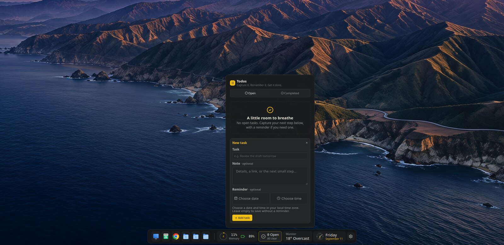
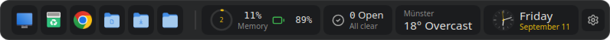
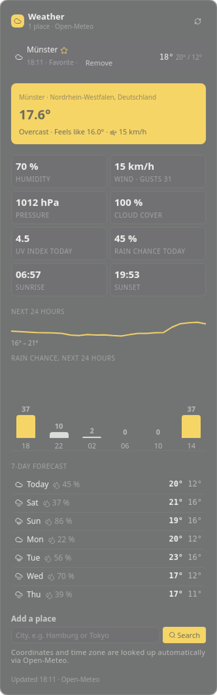
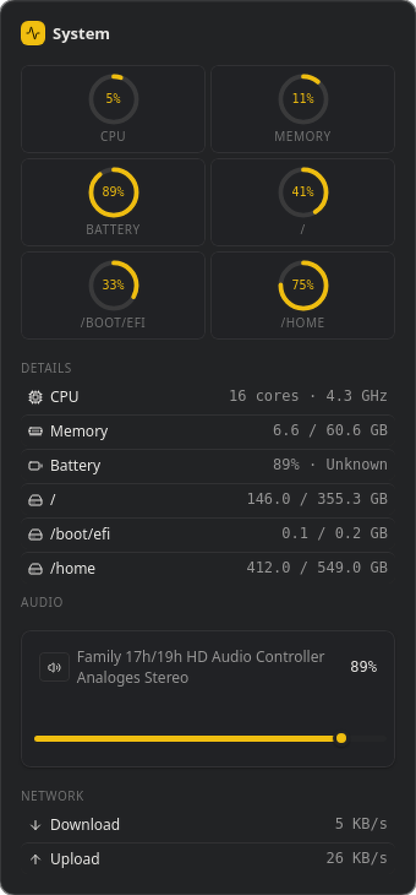
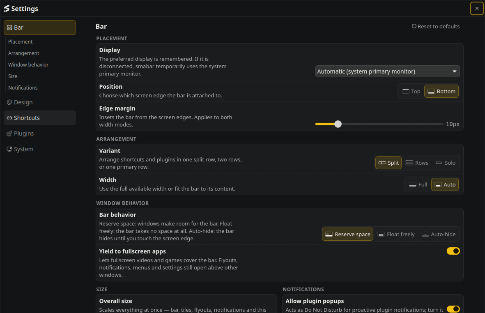
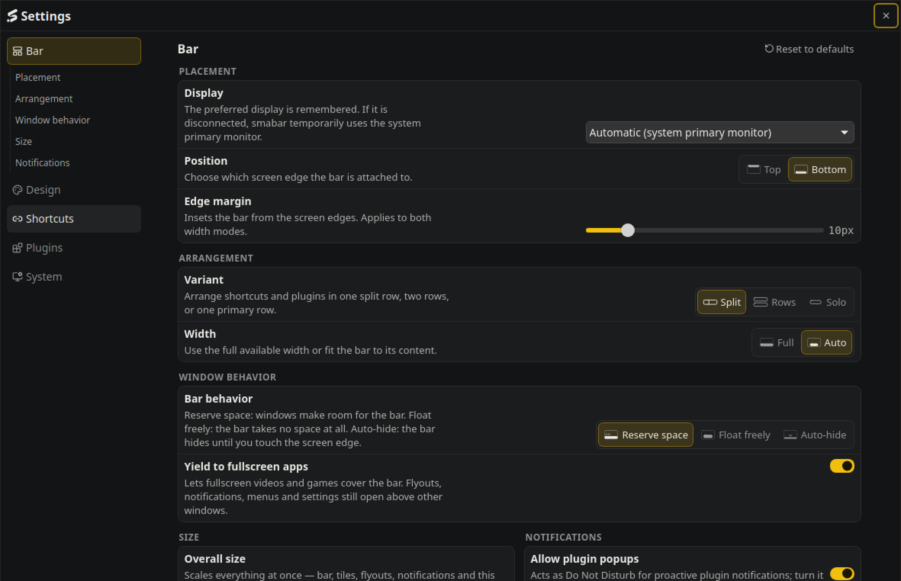
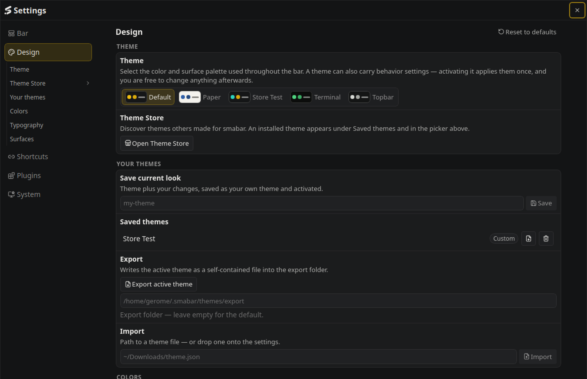
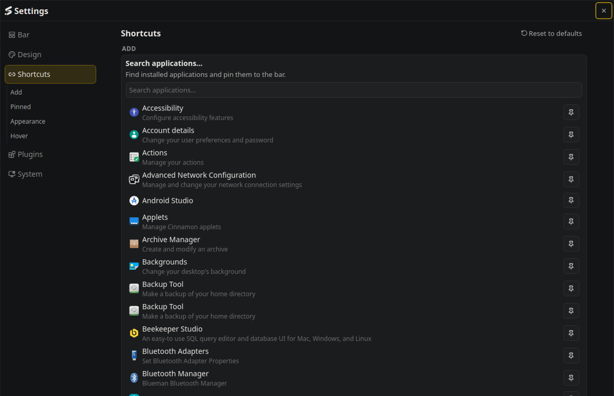
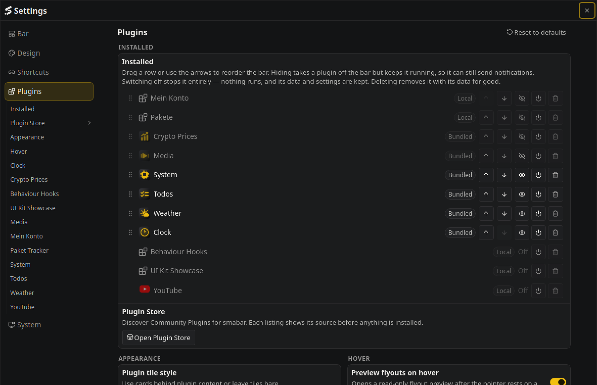
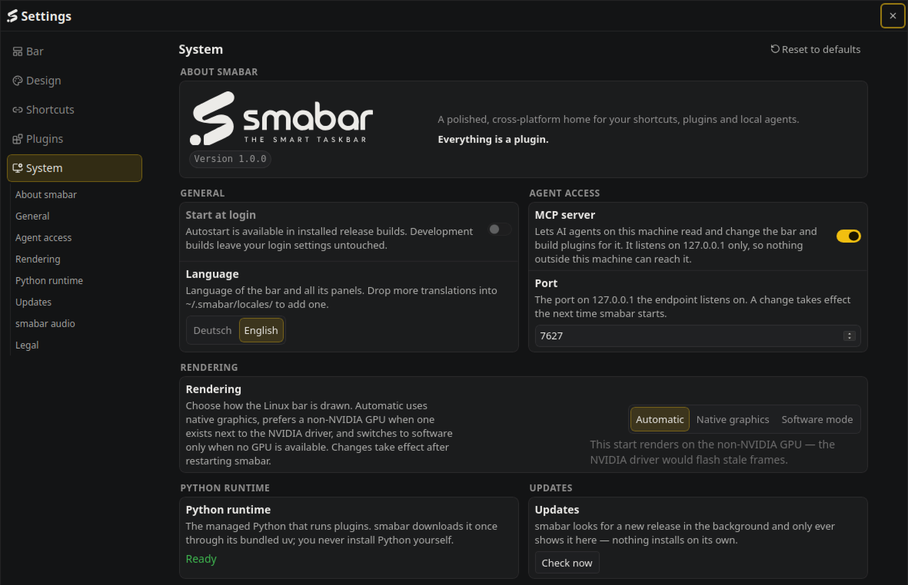

<div align="center">


# smabar

**Your app dock. Extendable with your own plugins.**

Linux · Windows · macOS (beta)

<a href="https://github.com/PleasePrompto/smabar/releases/latest"></a>
<a href="https://github.com/PleasePrompto/smabar/releases"></a>
<a href="LICENSE"></a>

[Download](https://smabar.com/download/) · [Docs](https://smabar.com/docs/) · [Plugin Store](https://smabar.com/store/) · [Changelog](https://smabar.com/changelog/)



</div>

Pin apps, folders, files and websites to one edge of the screen. Add plugins
for whatever you want to keep an eye on: clock, system, media, weather, crypto
and todos come built in, more are in the store, and a coding agent can write
you a new one over MCP. smabar runs beside your system taskbar; it shows no
window list and no tray.



## Install

Packages, checksums and release notes: **https://smabar.com/download/**

| Platform | Package | Notes |
| --- | --- | --- |
| Linux x86-64 | `.deb` (Debian, Ubuntu, Mint), `.rpm` (Fedora, openSUSE) | `sudo apt install ./smabar_<version>_amd64.deb` or `sudo dnf install ./smabar-<version>.x86_64.rpm`. X11 and Wayland with layer-shell. |
| Windows x64 | installer, or the Microsoft Store | The installer carries no Authenticode certificate, so SmartScreen asks once. |
| macOS 13+ | `.dmg` for Apple Silicon and Intel — **beta** | Drag smabar to Applications. The app is not notarized: allow the first start under System Settings › Privacy & Security. No click-through, no screenshots, no volume or media providers yet. |

Direct installations check for signed updates and install them only after you
confirm. Plugins need Python; smabar sets it up on first use.

## Plugins

A plugin is a tile on the bar, a flyout for the details and a popup when
something happens. Everything about it lives in your home directory:
`~/.smabar/plugins/<id>/` holds the code, `~/.smabar/data/<id>/` its data,
`~/.smabar/logs/` its log. Edit a file and the plugin reloads.

**Any language.** A plugin is a process that speaks JSON-RPC 2.0 over stdin
and stdout, one message per line: it receives its settings, renders HTML and
hears about clicks. `"runtime": "exec"` starts whatever program you name, in
Go, Rust, Node or a shell script.

**Python without setup.** smabar ships uv and installs its own Python 3.14
under `~/.smabar/tools/`, separate from anything on your system.
`"runtime": "python"` has uv prepare an environment from the script header
(PEP 723) and then starts that environment's Python directly, so dependencies
are installed on first start and no uv process stays resident. The
SDK in [`sdk/`](sdk/) (MIT) handles the protocol; a plugin is `render()`,
`log()` and `on_action()`. The six bundled plugins in [`plugins/`](plugins/)
(MIT) are the reference.

<div align="center">
&nbsp;&nbsp;&nbsp;&nbsp;

</div>

More plugins and themes are in the [Plugin Store](https://smabar.com/store/).
They live in public GitHub repositories; the catalog is signed, and the app
asks before it installs anything.

To build a plugin in a web AI chat, share [Build my plugin](https://smabar.com/build-my-plugin/)
or its [Markdown entry](https://smabar.com/build-my-plugin.md). It links the full SDK,
styling contracts and complete examples and guides the AI to a ZIP for manual installation.
The AI needs browsing and file creation tools; checks in the running app happen after installation.

## MCP: your agent builds and uses plugins

The bar runs an MCP server at `http://127.0.0.1:7627/mcp`, localhost only.
Connect Claude Code, Codex or any MCP client you run locally
([setup](https://smabar.com/docs/connect-your-agent/)). It can do two things.

**Build a plugin.** Describe what you want to see:

> Show the next departures of bus 412 from Marktplatz on the bar. Count the
> minutes down and send a popup two minutes before.

The agent reads the built-in guide (`plugin_guide`), writes the files into
`~/.smabar/plugins/` (`plugin_write_file`) and the plugin runs without a
restart. Every write answers with the plugin's warnings and render status, so
the agent checks its own work.

**Use a plugin.** A running plugin can register commands with JSON Schemas;
the agent discovers them with `plugin_commands` and calls them with
`plugin_call`. The bundled Todos plugin registers `todos.list`, `todos.create`,
`todos.update`, `todos.complete`, `todos.reopen`, `todos.delete` and
`todos.snooze`. The tasks live in `~/.smabar/data/todos/` and never leave your
machine. One paragraph in your project's `CLAUDE.md`, and your agent plans
against the same list you see on the bar:

```markdown
My tasks live in smabar's Todos plugin. Before planning, read them through the
smabar MCP tool `plugin_call` (plugin `todos`, command `todos.list`). Create
the next steps with `todos.create`, with a reminder where it helps, and
complete finished ones with `todos.complete`.
```

## Make it yours

Top or bottom edge. Reserve space, float freely or auto-hide. A fisheye that
magnifies the tile under the pointer. Four themes built in; a theme is one
JSON file with colours, fonts and behaviour, so describing a look to your agent
is enough to get a new one.



<div align="center">
<a href=".github/readme/settings-bar.png"></a>
<a href=".github/readme/settings-design.png"></a>
<a href=".github/readme/settings-shortcuts.png"></a>
<a href=".github/readme/settings-plugins.png"></a>
<a href=".github/readme/settings-system.png"></a>
</div>

## Boring where it counts

- Every plugin is its own process. A crashing plugin never takes the bar with it.
- Plugins deliver HTML, no JavaScript. The bar sanitises the markup and provides the interactions itself.
- No cloud, no account. The MCP server listens on localhost only.
- Plugin processes run with your user rights, so read a plugin before you install it. The source is here: read every line before you trust it.

## Build from source

Stable Rust (`rust-toolchain.toml`), Bun, uv and `just`. Linux additionally
needs the Tauri system libraries listed in `.github/workflows/ci.yml`.

```sh
just check   # every gate: format, lint, tests
just dev     # the app against the Vite dev server
just build   # release bundles for this machine
```

With the website checkout alongside this repository, `just plugin-docs ../website`
exports the public authoring references. `just plugin-docs-check ../website` detects
stale output without writing. The exporter uses the app's Rust schema/theme functions
and tracked guide, UI-kit and example files; it never connects to a live profile.
Commit source changes before exporting so the website records their source revision.

## Contributing

Bug reports and pull requests are welcome. See [CONTRIBUTING.md](CONTRIBUTING.md).

## License

[PolyForm Shield 1.0.0](LICENSE). The plugin SDK in `sdk/` and the bundled
plugins in `plugins/` are additionally available under the MIT license.
